# Projeto Fase 2

## Nome: `Ana Caroline Cagliari Cappellari`

<!-- Este README.md deve ter uma breve explicação sobre como executar o projeto, uma descrição do que cada componente realiza e como esses são conectados a API. -->

## Descrição do projeto
Este projeto é desenvolvido em React com o intuito de realizar um CRUD de Carrinhos HotWhells contendo um formulário de cadastro, podendo incluir, excluir e editar os itens, além da visualização da lista já cadastrada. Validações e feedbacks em cada funcionalidade também estão incluídos.

## Como Executar API
1. Entre pasta hotwheels-api no terminal:
```
cd exemplos/hotwheels-api
```

2. Navegue até o diretório da API.
```
cd hotwheels-api
```

3. Rode npm install para instalar as dependências da API:
```
npm install 
```

4. E em seguida, npm start, para iniciar a execução da API.
```
npm start
```

## Como Executar o Projeto
1. Entre pasta pucrs-projeto2 no terminal:
```
cd exemplos/pucrs-projeto2
```

2. Navegue até o diretório do projeto.
```
cd pucrs-projeto2
```

3. Rode npm install para instalar as dependências do projeto:
```
npm install 
```
4. Constate que a API está rodando.

5. E em seguida, npm start, para iniciar a execução do projeto.
```
npm start
```

## Componentes
Os componentes estão no diretório `./src/components`
- MyHeader:
  - Componente com conteúdo sobre o cabeçalho recebendo via props o título da página.

- MyFooter:
  - Componente com conteúdo sobre o rodapé.

- NavBar:
  - Componente com conteúdo sobre a navegação via roteamento das páginas "Início", "Sobre" e "Carros".

- CarForm:
  - Componente com conteúdo de um carro para inclusão ou alteração, validando as entradas e se comunicando com o CarList via props.

## Hooks
O Hook está no diretório `./src/hooks`
- useFetch:
    - Utilizado para simplificar as chamadas dos componentes para o Service.

## Services
O Service está no diretório `./src/services`
- carService:
    - Utilizado para integrar com a API de backend.

## Páginas
As páginas estão no diretório `./src/pages`
- Home:
  - Página com conteúdo sobre o link correspondente ao "Início".

- About:
  - Página com conteúdo sobre o link correspondente ao "Sobre".

- NotFound:
  - Página com conteúdo sobre erro ao digitar um caminho sem rota existente.

- CarList:
  - Página com conteúdo de lista de carros e responsável por sua manipulação. Listagem e exclusão dentro do próprio componente, edição e inclusão através do componente CarForm chamado em forma de Modal. 

## Testes
Os testes estão no diretório `./src/tests`
Criei duas suítes de testes: uma para o CarList e outra para o CarForm, totalizando 9 testes. Neles busquei cobrir cenários de negócio.

# Como Executar Testes
1. Rode npm tests para executar os testes.
```
npm tests
```

## Screenshots

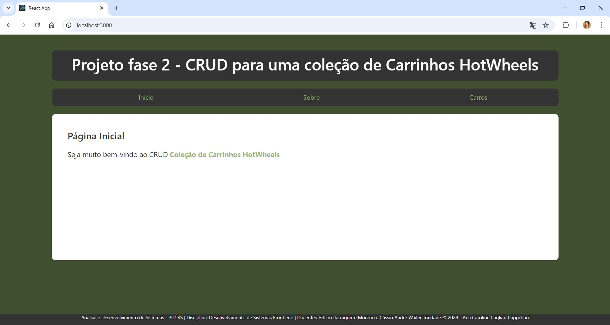
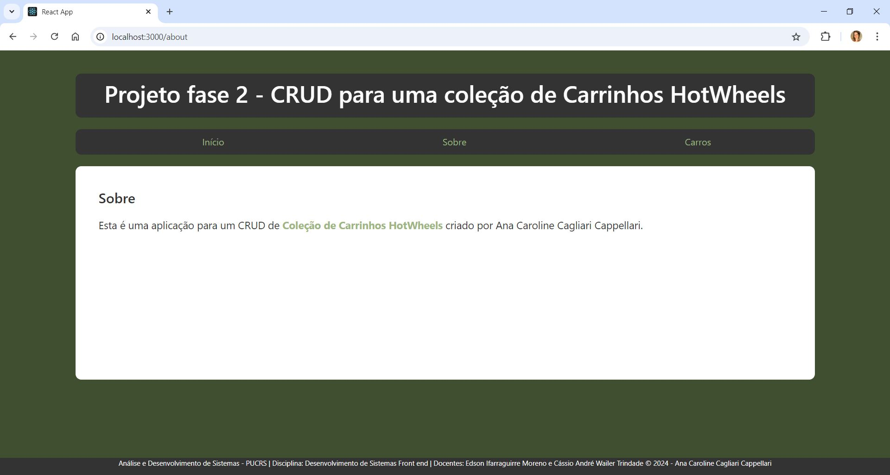
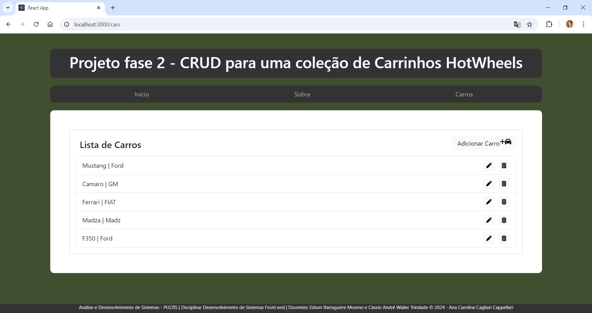
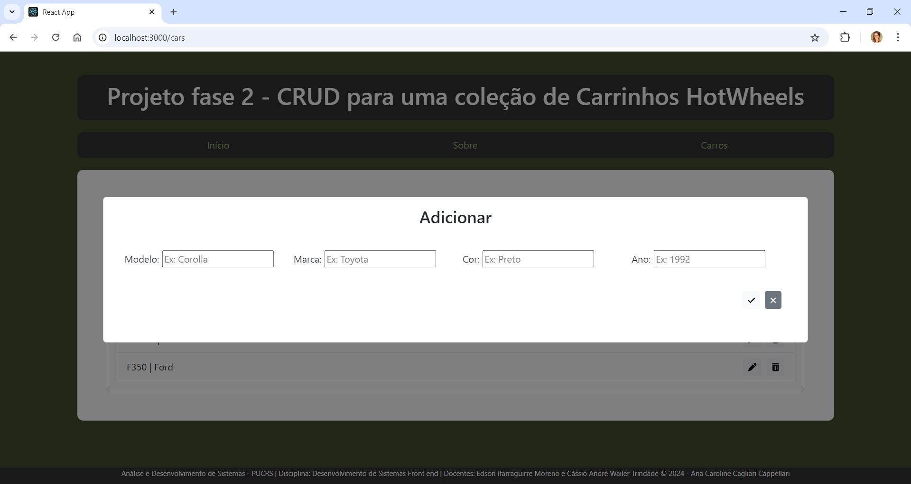
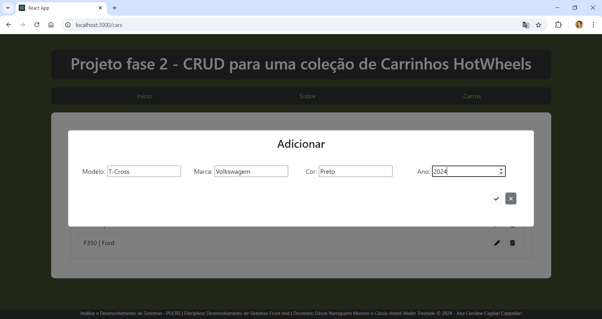
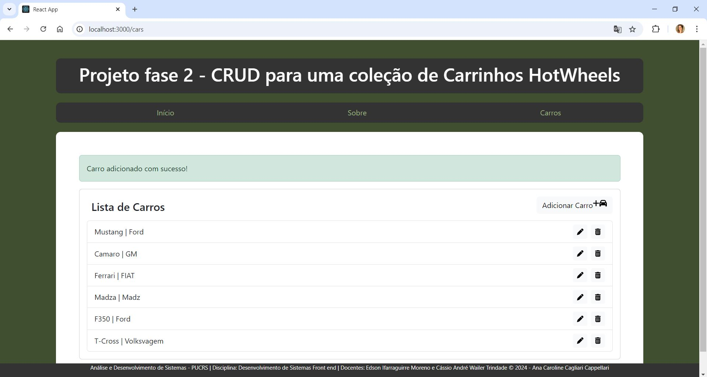
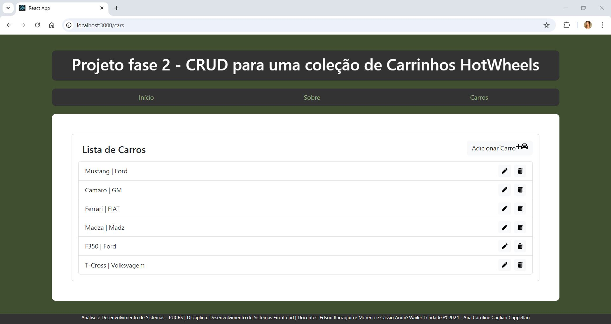Modalidade de Pagamento: 
(   ) NOTA FISCAL ELETRONICA  (   ) RPA (RECIBO DE PAGAMENTO DE AUTONOMOS)


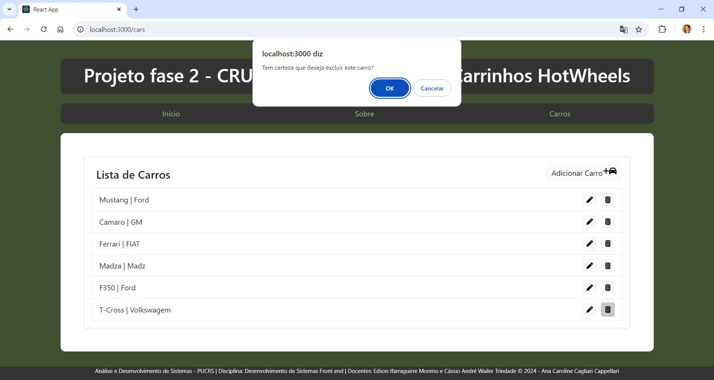
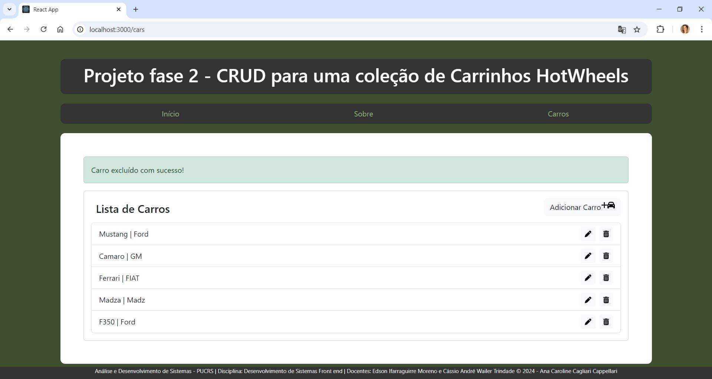
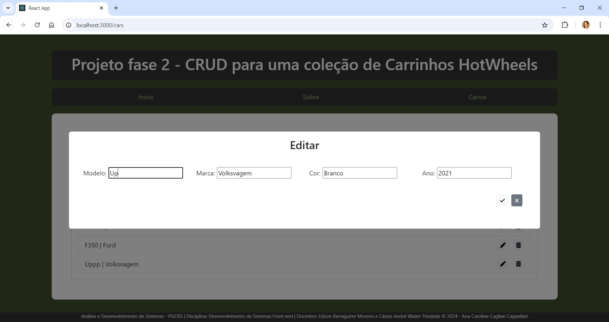
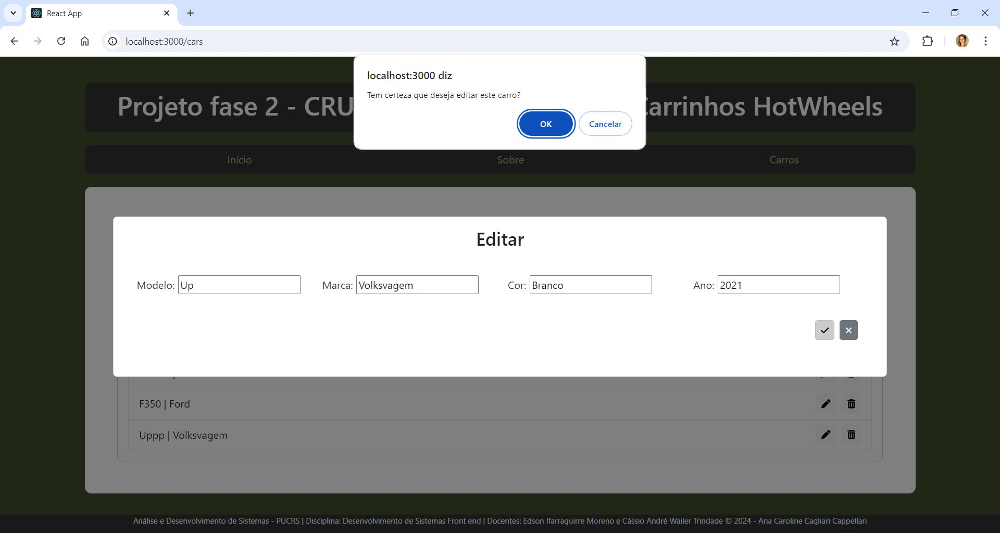
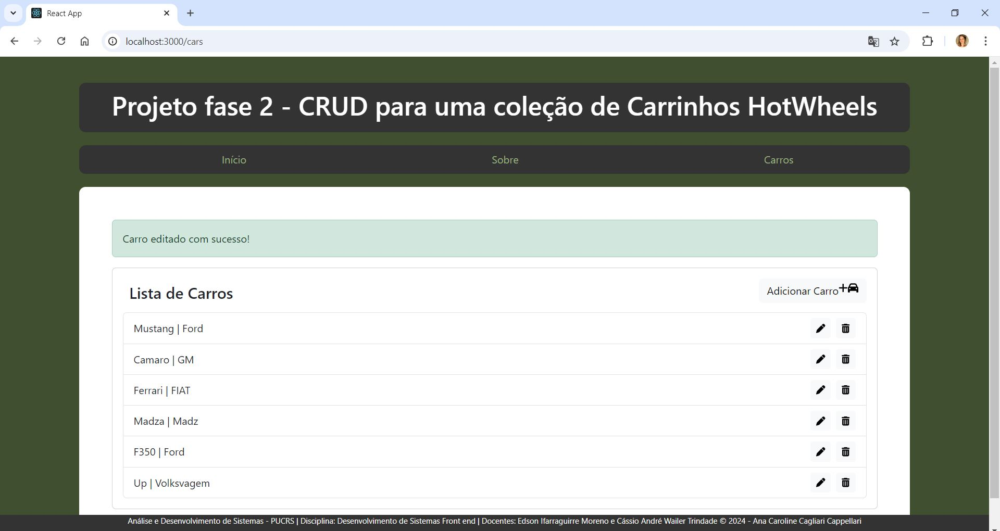
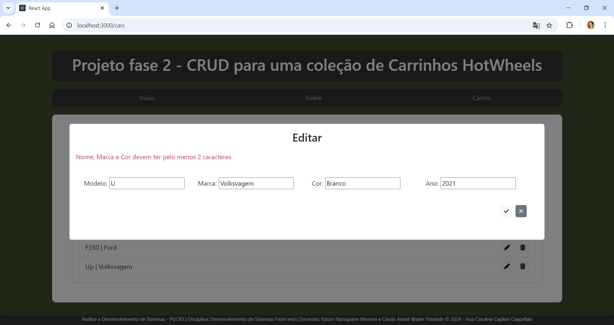
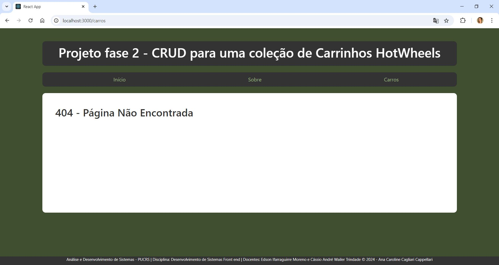
