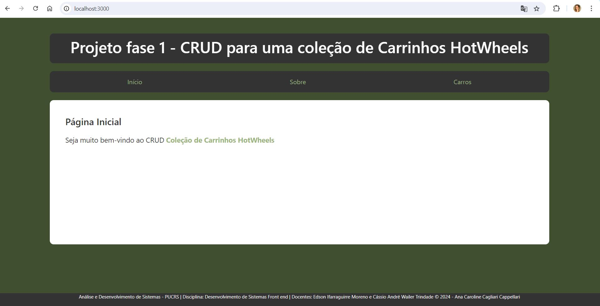
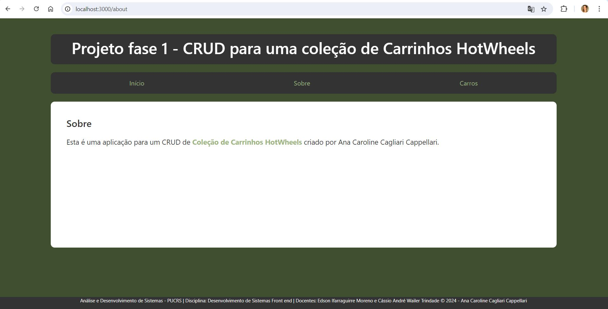
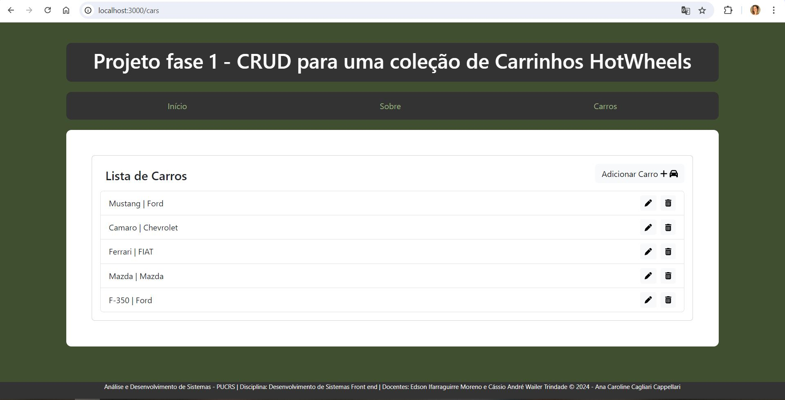
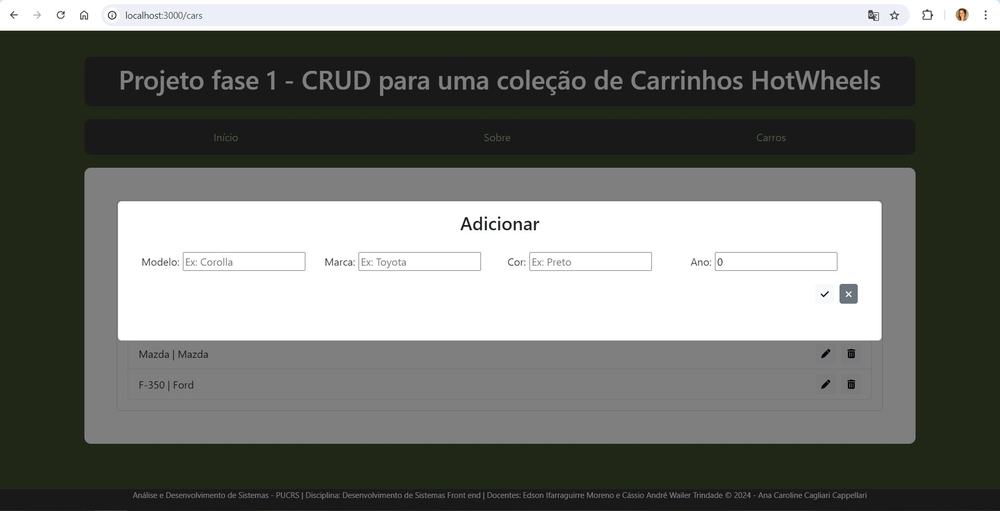
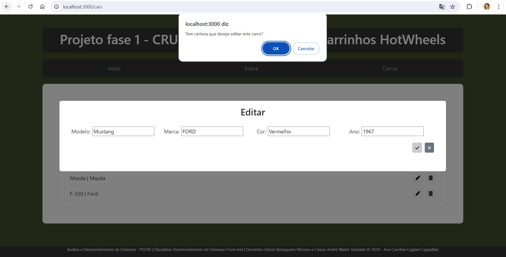
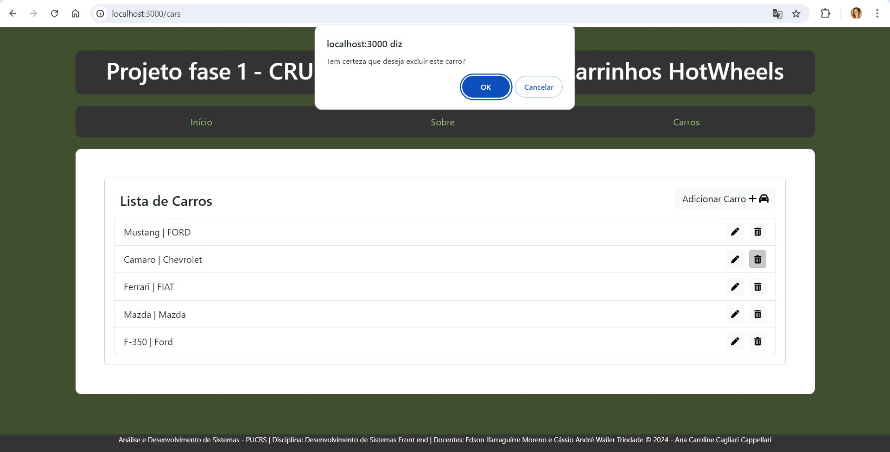

# Projeto Fase 1
`Orientações gerais:`Critérios de Avaliação:``
[...]deve ter uma breve explicação sobre como executar o projeto e uma descrição do que cada componente realiza. Você também pode utilizar este arquivo para documentar suas decisões no desenvolvimento do projeto.[...]
`Critérios de Avaliação:` 0.5 pontos
O projeto está acompanhado de documentação (README.md) clara e objetiva (explica todos os passos para rodar a aplicação desde o npm install), bem estruturada e com escrita adequada (seguindo o template fornecido, contendo a identificação do aluno e uma descrição do que cada componente realiza e apresentando prints de como a aplicação ficou).

## Nome: `Ana Caroline Cagliari Cappellari`

## Descrição do projeto
Este projeto é desenvolvido em React com o intuito de realizar um CRUD contendo um formulário de cadastro, podendo incluir, excluir e editar os itens, além da visualização da lista já cadastrada. Validações e feedbacks em cada funcionalidade tamém estão incluídao.

## Como Executar
1. Entre pasta pucrs-projeto1 no terminal:
```
cd exemplos/pucrs-projeto1
```

2. Navegue até o diretório do projeto.
```
cd pucrs-projeto1
```

3. Rode npm install para instalar as dependências do projeto:
```
npm i --save @fortawesome/react-fontawesome@latest
npm i --save @fortawesome/free-solid-svg-icons
npm install bootstrap
```

4. E em seguida, npm start, para iniciar a execução do projeto.
```
npm start
```

## Componentes
Os componentes estão no diretório `./src/Components`
- Home:
  - Componente com conteúdo sobre o link correspondente ao "Início".

- About:
  - Componente com conteúdo sobre o link correspondente ao "Sobre".

- MyHeader:
  - Componente com conteúdo sobre o cabeçalho recebendo via props o título da página.

- MyFooter:
  - Componente com conteúdo sobre o rodapé.

- NavBar:
  - Componente com conteúdo sobre a navegação via link das páginas "Início", "Sobre" e "Carros".
  - Optei por concentrar toda manipulação, listagem e exclusão de carros dentro de apenas um link, priorizando a usabilidade (Tudo de carro dentro do menu "Carros").

- NotFound:
  - Componente com conteúdo sobre erro ao digitar um caminho com URL inexistente.

- CarList:
  - Componente com conteúdo de lista de carros e responsável por sua manipulação. Listagem e exclusão dentro do próprio componente, edição e inclusão através do componente CarForm chamado em forma de Modal. 
  - Optei por carregar a lista de carros dentro do componente pois acredito que a responsabilidade sobre a lista é deste componente, e não do App para enviar via props.

- CarForm:
  - Componente com conteúdo de um carro para inclusão ou alteração, validando as entradas e se comunicando com o CarList via props.

### carsData
Lista inicial de carros.

## Screenshots







